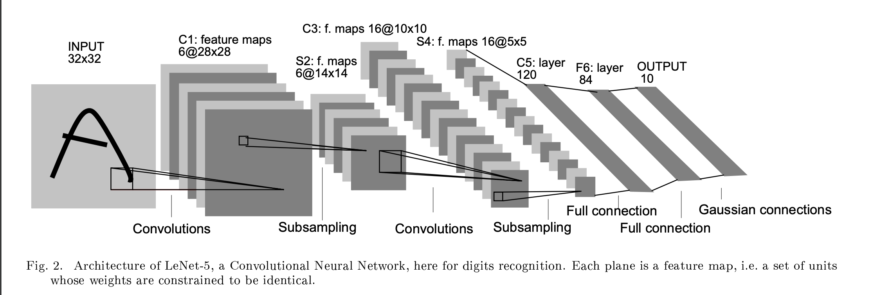

# Papers From Scratch — Computer Vision 

Just practising 🎀


##  Implemented Papers

### 1. LeNet-5 (1998)

 <!-- Replace with actual image path -->

- **Original paper:** [Gradient-Based Learning Applied to Document Recognition](http://vision.stanford.edu/cs598_spring07/papers/Lecun98.pdf)
- **Folder:** [`LENET5`](LENET5)

---

### 2. ResNet (2015)

 <!-- Replace with actual image path -->

- **Original paper:** [Deep Residual Learning for Image Recognition](https://arxiv.org/abs/1512.03385)
- **Folder:** [`RESNET`](RESNET)

---
### 3. Transformer (2017)

 <!-- Replace with actual image path -->

- **Original paper:** [Attention is All you Need](https://arxiv.org/pdf/1706.03762)
- **Folder:** [`Transformer`](Transformer)

---

## TO RUN
Go to folder and run train/test files as needed:☺

```bash
cd experiments/lenet
python train.py

cd ../resnet
python train.py
